# NSO GameCube Controller Enabler — Architecture Diagrams

## High-Level Architecture

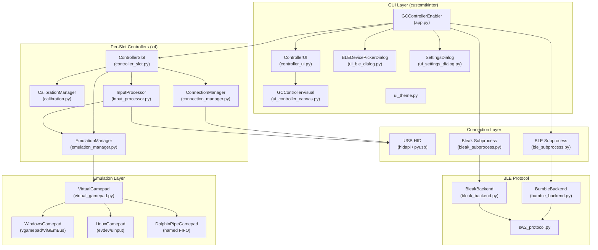

---

## Controller Slot Composition

Each of the 4 controller slots is an independent unit containing its own managers:

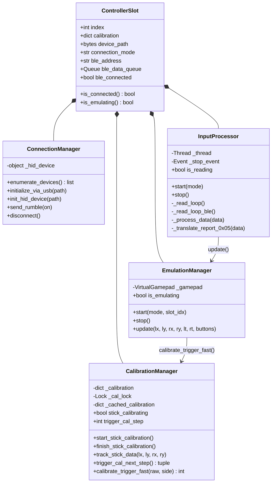

---

## Virtual Gamepad Class Hierarchy

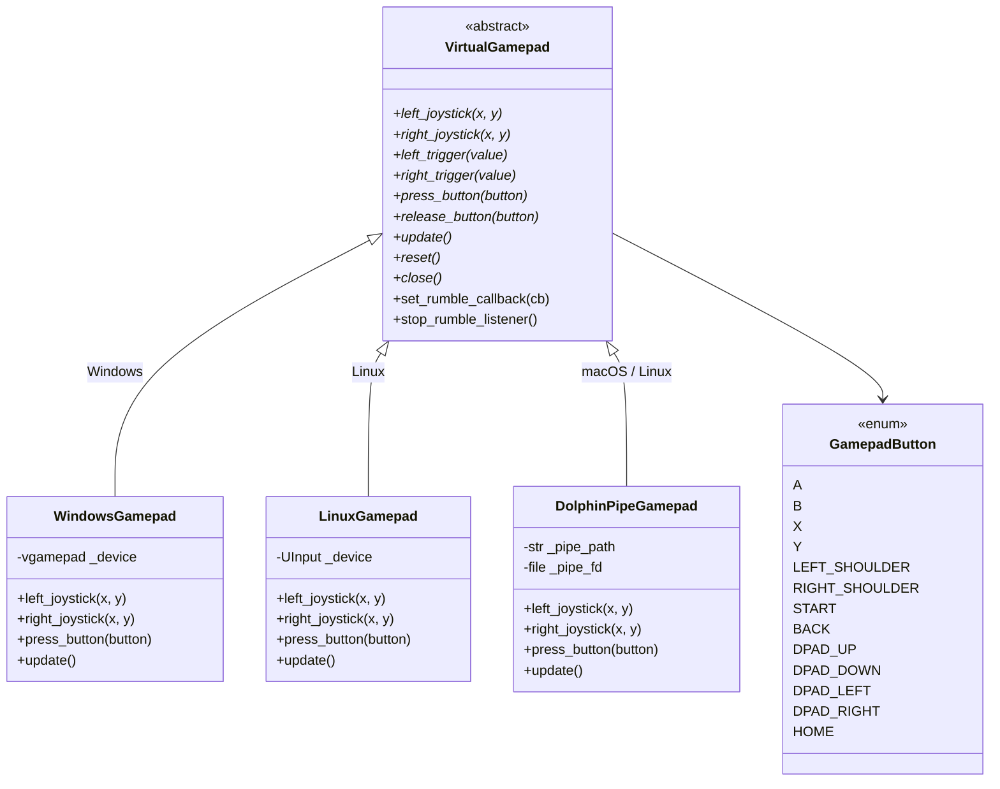

---

## USB Connection Flow

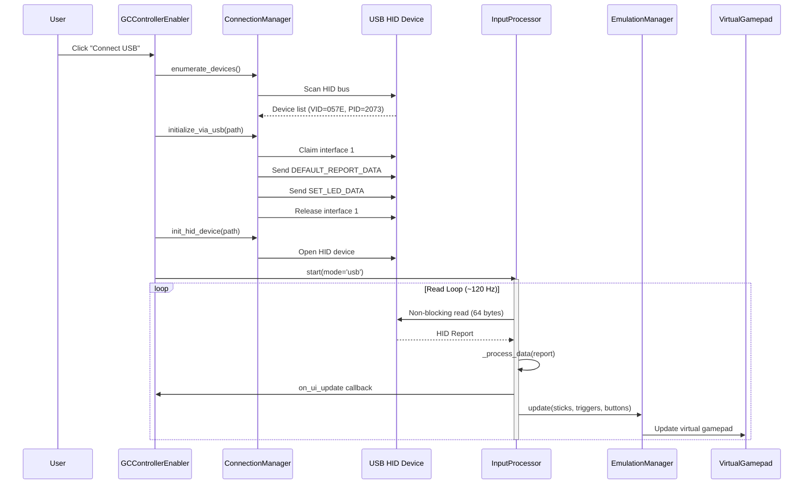

---

## BLE Connection Flow (Linux — Bumble)

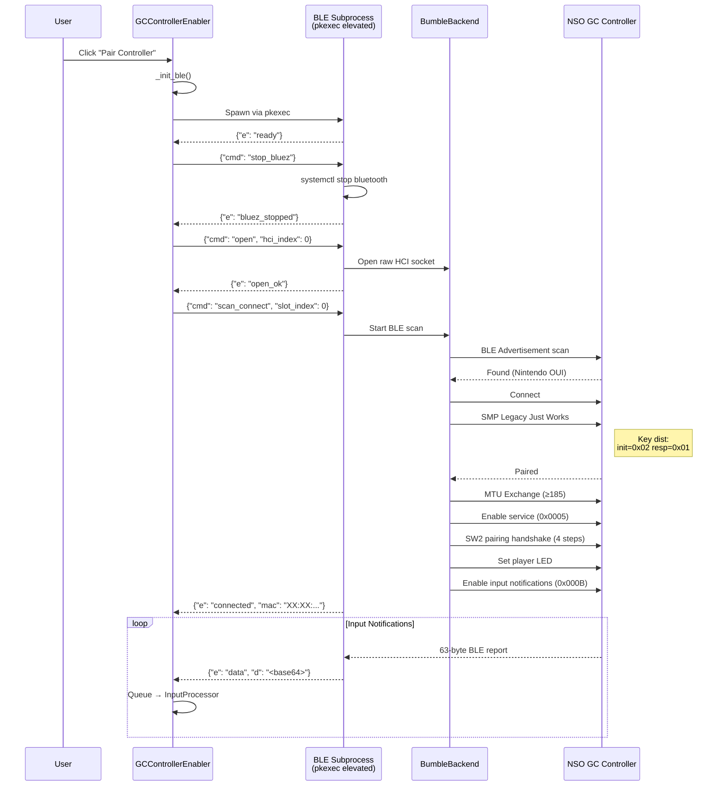

---

## BLE Subprocess IPC Protocol

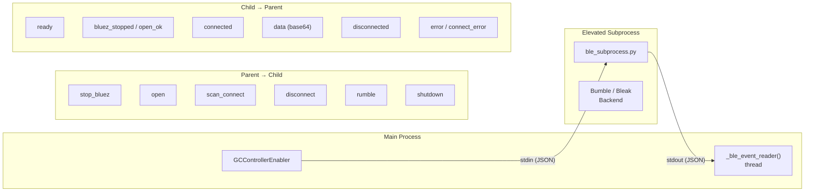

---

## Input Processing Pipeline

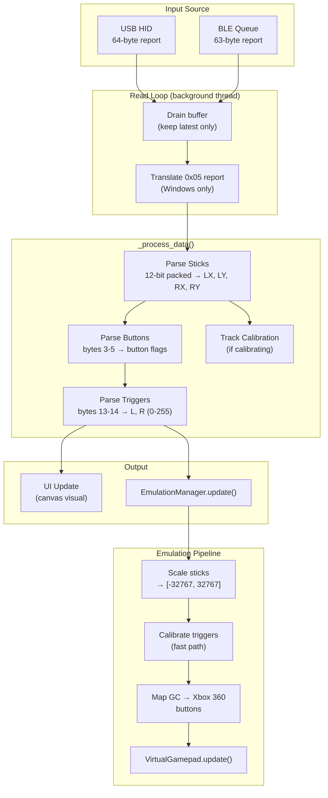

---

## USB HID Report Structure

```mermaid
block-beta
    columns 16

    block:header:4
        B0["[0] Report ID"]
        B1["[1] Unknown"]
        B2["[2] Unknown"]
    end
    block:buttons:4
        B3["[3] Buttons 0<br/>B A Y X R Z Start"]
        B4["[4] Buttons 1<br/>DD DR DL DU L ZL"]
        B5["[5] Buttons 2<br/>Home Cap GR GL Chat"]
    end
    block:sticks:8
        B6["[6-8] Left Stick<br/>12-bit LX, LY"]
        B9["[9-11] Right Stick<br/>12-bit RX, RY"]
    end

    block:triggers:4
        B12["[12] Unknown"]
        B13["[13] L Trigger<br/>0x00-0xFF"]
        B14["[14] R Trigger<br/>0x00-0xFF"]
    end
    block:rest:4
        BIMU["[15-61] IMU / Motion"]
        BPAD["[62-63] Padding"]
    end
```

---

## Stick Calibration — Octagon Model

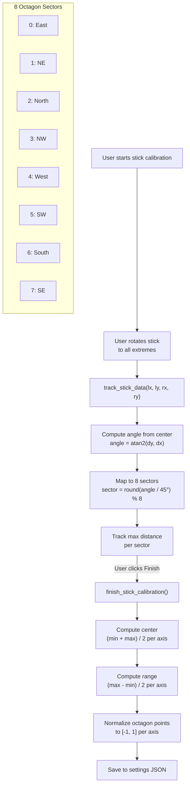

---

## Trigger Calibration Wizard

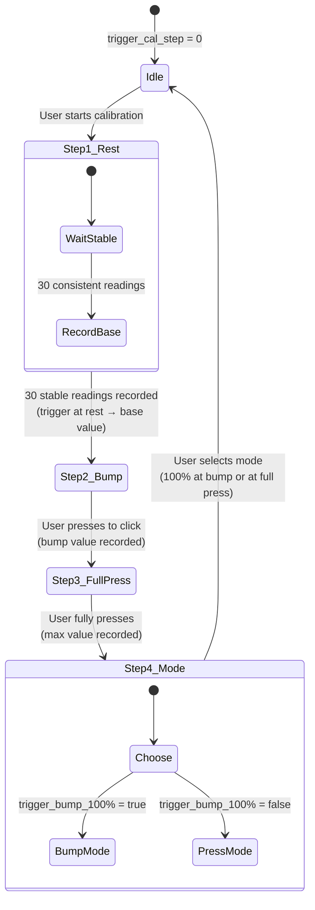

---

## Auto-Reconnect Logic

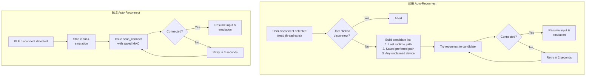

---

## Threading Model

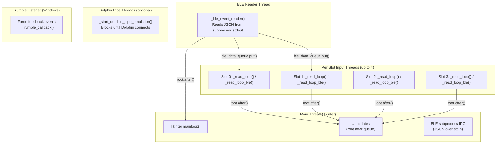

---

## Settings Persistence

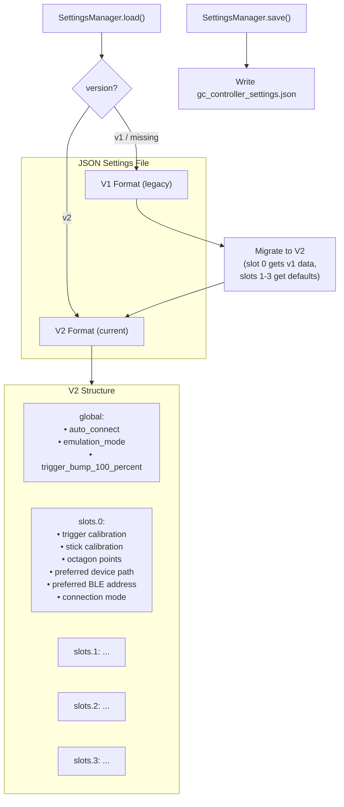

---

## Platform Support Matrix

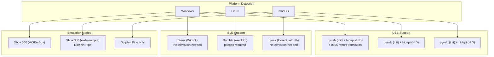

---

## Application Startup Flow

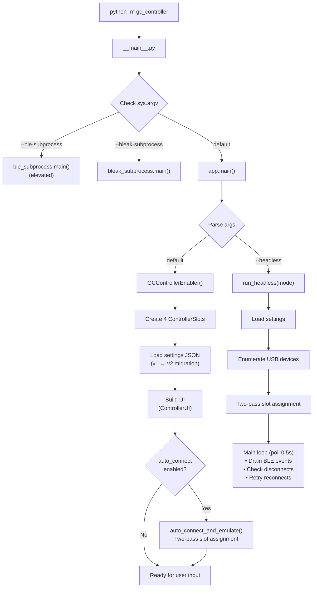

---

## Complete Module Dependency Graph

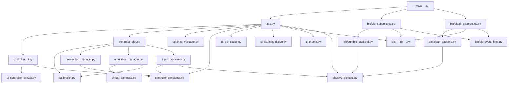

---

## Emulation Data Flow

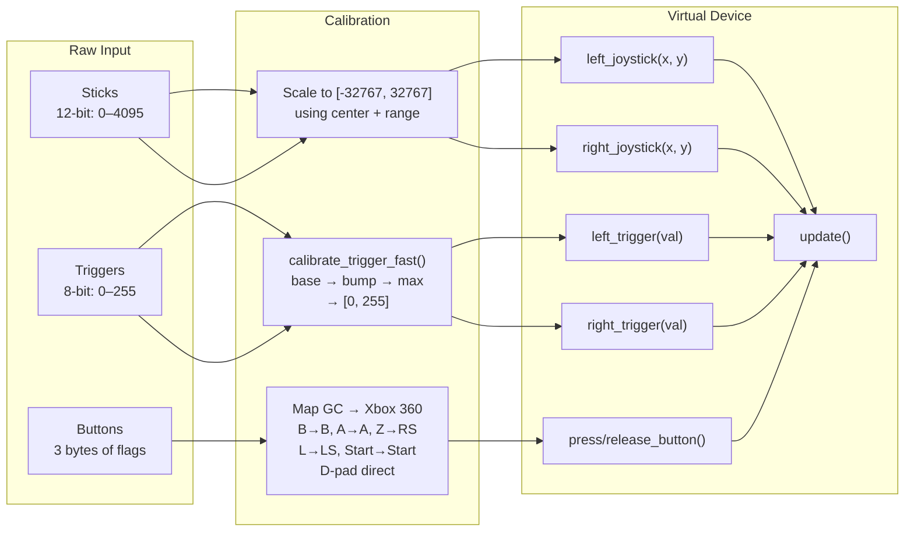
