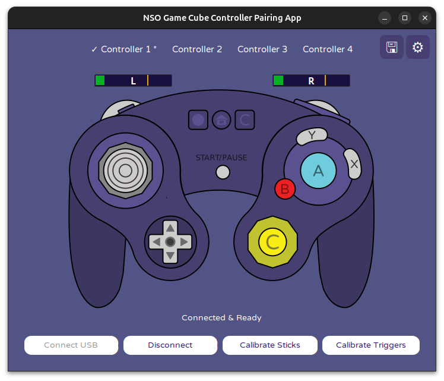

# NSO GameCube Controller Pairing App

A cross-platform Python/Tkinter tool that connects the [Nintendo Switch Online GameCube Controller](https://www.nintendo.com/us/store/products/nintendo-switch-2-nintendo-gamecube-controller-120833/) via USB or Bluetooth and makes it usable on Steam and other platforms through Xbox 360 controller emulation. Supports up to 4 simultaneous controllers.

> **Note:** This app is designed specifically for the **NSO GameCube Controller** (Vendor ID `0x057e`, Product ID `0x2073`). A [Nintendo Switch Online](https://www.nintendo.com/us/switch/online/) membership ($3.99/month) is required to purchase the controller from the Nintendo Store, but only needs to be active for one month.

## Features

- **Multi-controller support** — connect up to 4 controllers simultaneously, each with independent calibration and settings
- **USB and Bluetooth** — connect via USB HID or Bluetooth Low Energy (BLE on Linux, macOS, and Windows)
- **Xbox 360 emulation** — virtual gamepad via vgamepad on Windows and evdev/uinput on Linux
- **Dolphin pipe mode** — named FIFO pipes for direct Dolphin emulator integration (Linux/macOS)
- **Stick calibration** — octagon-based deadzone detection across 8 directional sectors
- **Trigger calibration** — guided wizard to set base, bump, and max values per controller
- **Headless mode** — run without a GUI for background/daemon-style operation
- **Auto-connect** — automatically reconnect to preferred controllers on startup
- **Persistent settings** — per-slot calibration, device preferences, and emulation mode saved to JSON

## Platform Support

| Feature | Windows | Linux | macOS |
|---|---|---|---|
| USB connection | Yes | Yes | Yes |
| Bluetooth (BLE) | Yes | Yes | Yes |
| Rumble (USB) | No* | Yes | ? |
| Rumble (BLE) | Yes | Yes | ? |
| Xbox 360 emulation | Yes (ViGEmBus) | Yes (evdev/uinput) | — |
| Dolphin pipe mode | — | Yes | Yes |

\* **Windows USB rumble**: The controller's command interface is not accessible through the Windows HID driver. Rumble works over Bluetooth, or over USB if you install a [WinUSB driver via Zadig](https://zadig.akeo.ie/) for the controller's vendor-specific interface (interface 1).

## Bluetooth Chipset Compatibility

| Chipset | Tested Adapter | Status |
|---|---|---|
| Qualcomm | TP-Link UB500 (USB ID `2357:0604`) | Working |
| Realtek RTL8761B | MSI onboard (Foxconn, USB ID `0489:e10a`) | Not working |
| Intel | Unknown | Partial (pairing works, reconnection is glitchy) |
| Broadcom | — | Unknown |

## Requirements

- Python 3.7+
- Platform-specific dependencies (see below)

## Installation

1. Install Python dependencies:
```bash
pip install -r requirements.txt
```

2. Platform-specific setup:

### Windows
- Install the [ViGEmBus driver](https://github.com/nefarius/ViGEmBus/releases) for Xbox 360 emulation — download the latest `ViGEmBus_Setup_x64.msi` from the releases page, run the installer, and reboot
- **For Bluetooth**: install the [Bleak](https://github.com/hbldh/bleak) BLE library (`pip install bleak`). No elevated privileges needed — Windows BLE runs in userspace via WinRT.


### Linux
- Install libusb: `sudo apt install libusb-1.0-0-dev` (Ubuntu/Debian) or `sudo dnf install libusb1-devel` (Fedora)
- Add your user to the `input` group: `sudo usermod -aG input $USER`
- Install udev rules for controller and uinput access:
```bash
sudo cp platform/linux/99-gc-controller.rules /etc/udev/rules.d/
sudo udevadm control --reload-rules && sudo udevadm trigger
```
- Log out and back in for group changes to take effect
- **For Bluetooth**: install the [Bumble](https://github.com/nickoala/bumble) BLE stack (`pip install bumble`). BLE requires elevated privileges and will prompt via `pkexec`.

### macOS
- Install libusb: `brew install libusb`
- **For Bluetooth**: install the [Bleak](https://github.com/hbldh/bleak) BLE library (`pip install bleak`). No elevated privileges needed — CoreBluetooth runs in userspace.
- Xbox 360 emulation is not available on macOS; use Dolphin pipe mode instead

## Usage

Install in development mode and run:
```bash
pip install -e .
python -m gc_controller
```

1. Connect your GameCube controller via USB or click **Pair Controller** to connect over Bluetooth
2. Click **Connect** to initialize a USB controller (or use **Auto-connect at startup**)
3. Select an emulation mode (**Xbox 360** or **Dolphin Named Pipe**) and click **Start Emulation**

### Headless Mode

Run without the GUI for background operation:
```bash
python -m gc_controller --headless
python -m gc_controller --headless --mode dolphin_pipe
```

This uses saved settings to auto-connect and emulate all configured controller slots.

## Building Executables

Platform-specific build scripts are in the `platform/` directory:

- **Windows**: `platform/windows/build.bat`
- **macOS**: `platform/macos/build.sh`
- **Linux**: `platform/linux/build.sh`

Or use the unified build script:
```bash
python build_all.py
```

## Calibration

### Trigger Calibration

Each GameCube controller may have different analog trigger ranges. The calibration wizard walks through 4 steps:

1. **Base Value** — resting trigger position (typically ~32)
2. **Bump Value** — position where the trigger "clicks" (typically ~190)
3. **Max Value** — fully pressed position (typically ~230)
4. **Trigger Mode** — choose between:
   - **100% at bump**: full response at the click point
   - **100% at press**: full response at maximum press

### Stick Calibration

Octagon-based calibration maps the physical range of each analog stick across 8 directional sectors. During calibration, rotate each stick around its full range to record the boundaries. Calibration data is saved per-slot.

## Project Structure

```
src/gc_controller/
  __init__.py               Package marker
  __main__.py               Entry point (python -m gc_controller)
  app.py                    Main application orchestrator
  controller_constants.py   Shared constants, button mappings, calibration defaults
  controller_slot.py        Per-controller state container
  settings_manager.py       JSON settings load/save (v2 multi-slot format)
  calibration.py            Stick and trigger calibration logic
  connection_manager.py     USB initialization and HID connection
  emulation_manager.py      Xbox 360 virtual controller emulation
  controller_ui.py          Tkinter UI widgets and display updates
  input_processor.py        HID read thread and data processing
  virtual_gamepad.py        Cross-platform gamepad abstraction
  ble/
    __init__.py             BLE availability detection and utilities
    bumble_backend.py       Bumble HCI transport and GATT client (Linux)
    bleak_backend.py        Bleak BLE backend (macOS/Windows)
    sw2_protocol.py         Switch controller BLE protocol (pairing, input reports)
    ble_subprocess.py       Privileged subprocess runner for BLE operations (Linux)
    bleak_subprocess.py     BLE subprocess for macOS/Windows (no elevated privileges)
    ble_event_loop.py       Asyncio integration helper
pyproject.toml              Project metadata and dependencies
NSO-GameCube-Controller-Pairing-App.spec  PyInstaller spec file
build_all.py                Unified build script
images/
  screenshot.png            Application screenshot
platform/
  linux/
    build.sh                Linux build script
    99-gc-controller.rules  udev rules for USB/uinput access
  macos/
    build.sh                macOS build script
  windows/
    build.bat               Windows build script
    hook-vgamepad.py        PyInstaller hook for vgamepad
```

## Troubleshooting

### Controller Not Detected
- Ensure the GameCube controller adapter is connected
- Verify Vendor ID `0x057e` and Product ID `0x2073` (check `lsusb` on Linux or Device Manager on Windows)

### Emulation Not Working
- **Windows**: install [ViGEmBus](https://github.com/nefarius/ViGEmBus) and `pip install vgamepad`
- **Linux**: install evdev (`pip install evdev`), ensure your user is in the `input` group, and install the udev rules
- **macOS**: Xbox 360 emulation is not supported; use Dolphin pipe mode

### Bluetooth Issues (Linux)
- BLE requires the Bumble library: `pip install bumble`
- The BLE subprocess needs elevated privileges and will prompt via `pkexec`
- BlueZ is temporarily stopped while BLE is active (Bumble takes direct HCI control)
- If Bluetooth fails to initialize, ensure your HCI adapter is available (`hciconfig`)

### Bluetooth Issues (Windows)
- BLE requires the Bleak library: `pip install bleak`
- No elevated privileges needed — Windows BLE runs in userspace via WinRT
- Put the controller in pairing mode (hold SYNC) before clicking **Pair Controller**
- If the controller isn't found, ensure Bluetooth is enabled in Windows Settings

### Bluetooth Issues (macOS)
- BLE requires the Bleak library: `pip install bleak`
- No elevated privileges needed — CoreBluetooth handles pairing and encryption automatically
- Put the controller in pairing mode (hold SYNC) before clicking **Pair Controller**
- If the controller isn't found, ensure Bluetooth is enabled in System Settings

### Permission Errors
- **Windows**: HID access may require administrator privileges
- **Linux**: add your user to the `input` group and install udev rules:
  ```bash
  sudo usermod -aG input $USER
  sudo cp platform/linux/99-gc-controller.rules /etc/udev/rules.d/
  sudo udevadm control --reload-rules
  ```
  Then log out and back in.

## Credits & Special Thanks

- [GVNPWRS/NSO-GC-Controller-PC](https://github.com/GVNPWRS/NSO-GC-Controller-PC) — original project this was based on
- [Nohzockt/Switch2-Controllers](https://github.com/Nohzockt/Switch2-Controllers) — Switch controller protocol reference
- [isaacs-12/nso-gc-bridge](https://github.com/isaacs-12/nso-gc-bridge) — macOS Bluetooth support reference
- [darthcloud/BlueRetro](https://github.com/darthcloud/BlueRetro) — Bluetooth protocol reference

## License

See the original LICENSE files for details.
